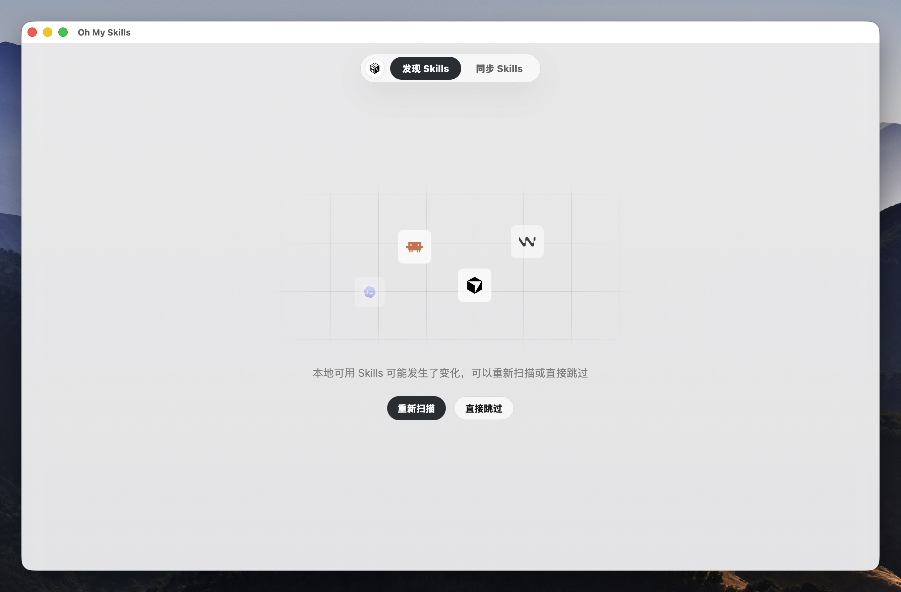
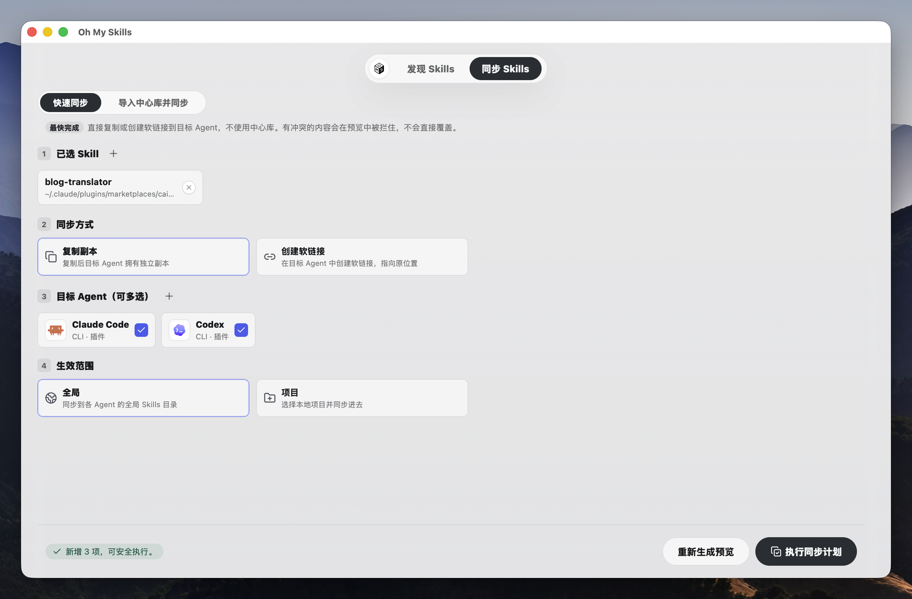

<div align="center">
  
  <h1>Oh My Skills</h1>
  <p><b>跨平台 Agent Skills 工作台</b></p>
</div>

**Oh My Skills** 是一个本地 Agent Skills 管理工具，帮助你在 Claude Code、Cursor、Windsurf、Zed、Codex 等多个 AI 编码工具之间发现、比较、采纳和安全同步 Skills。

所有文件修改都经过「预览 → 确认 → 执行」流程，由 Rust 后端负责实际磁盘操作，安全可控。

---

## 截图

<p align="center">
  
</p>

<p align="center">
  
</p>

> 更多截图见下方 **Screenshots** 部分（英文版同步更新）。

---

## 特性

- **Agent 自动发现**：扫描本机已安装的 AI 工具及其 Skills 目录
- **中心库管理**：把优质 Skills 统一收录到自己的中心库
- **智能同步**：
  - 支持全局（Global）和项目级（Project）范围
  - 多种同步策略：复制、创建软链接、快速迁移
- **安全第一**：任何写入操作前都生成详细的 Sync Plan，支持备份和冲突检测
- **问题诊断**：自动检测断链、孤儿目录、内容冲突、SKILL.md 格式问题
- **跨平台桌面体验**：使用 Tauri；macOS 使用 popover 毛玻璃，Windows 10/11 使用 acrylic 半透明效果
- **多工具支持**：Claude Code、Cursor、Windsurf、Zed、Codex、Cline、Gemini CLI、OpenCode、TRAE 等 20+ 工具

## 支持的 Agent 工具（部分）

Claude Code、Cursor、Windsurf、Zed、Codex、Cline、Gemini CLI、GitHub Copilot、OpenCode、TRAE、Warp、Qoder、Antigravity、Augment 等。

完整列表见应用内检测。

## 安装

### macOS

1. 从 GitHub Releases 下载最新 `Oh My Skills_*.dmg`
2. 打开 DMG 并将应用拖入「应用程序」文件夹
3. 首次启动可能需要在「系统设置 → 隐私与安全性」中允许

> 当前为早期版本（0.1.0），正式发布后会提供自动更新与公证版本。

### Windows 10/11

1. 从 GitHub Releases 下载最新 `Oh My Skills_*_x64-setup.exe`
2. 运行安装器并按提示完成安装
3. 如果要使用「软链接」同步，请开启 Windows Developer Mode，或以管理员身份运行 Oh My Skills；否则可以在快速迁移里选择「复制」

> Windows 安装包使用 NSIS，并会按需通过 WebView2 bootstrapper 安装或更新 WebView2 Runtime。

### 从源码构建

**前置要求**

- Node.js ≥ 18
- Rust（推荐使用 rustup）
- macOS 或 Windows 10/11

```bash
git clone https://github.com/你的用户名/oh-my-skills.git
cd oh-my-skills
npm install
npm run tauri:dev
```

构建当前平台的发布版本：

```bash
npm run tauri:build
```

也可以显式按平台构建：

```bash
npm run tauri:build:macos
npm run tauri:build:windows
```

构建产物位于：

```
src-tauri/target/release/bundle/dmg/Oh My Skills_0.1.0_aarch64.dmg
src-tauri/target/release/bundle/macos/Oh My Skills.app
src-tauri/target/release/bundle/nsis/Oh My Skills_0.1.0_x64-setup.exe
```

## 使用流程

1. **扫描**：启动后自动检测已安装 Agent 和它们的 Skills
2. **浏览**：在 Skills 视图搜索、按 Agent 筛选、查看覆盖情况
3. **采纳（Adopt）**：把外部优质 Skill 导入到中心库
4. **同步**：
   - 在 Skills 页面选中需要的 Skill
   - 切换到 Sync 页面，选择目标 Agent 和范围（全局/项目）
   - 点击「预览」查看详细操作计划（创建目录、复制、备份、软链接等）
   - 确认无误后「执行计划」

## 开发

```bash
# 开发模式（HMR）
npm run tauri:dev

# 仅前端
npm run dev

# 运行 Rust 测试
npm run test:rust

# 完整冒烟测试
npm run smoke
```

项目结构：

- `src/` — React + TypeScript 前端
- `src-tauri/` — Tauri v2 + Rust 后端（核心文件操作逻辑）
- `src-tauri/icons/` — 应用图标（使用 `npm run tauri icon` 生成）

## 构建与发布

```bash
npm run tauri:build
```

构建完成后可直接分发 macOS `*.dmg` 或 Windows `*-setup.exe`。

### 自动化发布（推荐）

项目已包含基础 CI 配置（`.github/workflows/ci.yml`）：

- Push / PR 到 `main` 时在 macOS 和 Windows 上自动运行前端构建 + Rust 测试
- 打 tag 后自动构建 macOS DMG 和 Windows NSIS installer，并发布到 GitHub Releases

这样用户无需本地配置完整 Rust 环境即可获得可直接运行的版本。

## 为什么需要 .github/workflows/？

Tauri 桌面应用打包依赖系统级工具链（Rust、Node、macOS SDK 等）。把构建流程放到 GitHub Actions 有以下优势：

- 用户可以**直接下载**编译好的 DMG，而不用自己 `git clone + npm install + rustup + tauri build`
- 构建环境统一、可复现，避免“在我机器上能跑”
- 方便未来支持 Windows / Linux 多平台
- 配合 GitHub Releases + 自动更新插件实现一键升级
- CI 可以顺便跑 lint、test、类型检查

Tauri 官方推荐使用 `tauri-apps/tauri-action` 来快速实现这个流程。

## 技术栈

- **前端**：React 18 + TypeScript + Vite + Lucide Icons
- **桌面**：Tauri v2（Rust）
- **后端逻辑**：Rust + walkdir + serde（文件扫描、同步计划生成）
- **样式**：安静、高密度的桌面工具风格（macOS popover / Windows acrylic）

## 状态

当前为 MVP 阶段（v0.1.0），核心功能可用：

- Agent 发现 + Skills 盘点
- 中心库 + 同步预览/执行
- macOS 与 Windows 桌面界面

后续计划：
- 更好的冲突解决与更新检查
- GitHub 同步来源支持
- 多平台构建与自动更新
- 更多 Agent 适配

## 截图

<p align="center">
  
</p>

**Skills 总览**：查看所有已发现的 Skills、覆盖哪些 Agent、状态如何。

<p align="center">
  
</p>

**同步预览**：选择 Skills 后生成详细操作计划（创建、复制、软链接、备份等），确认后再执行。

<p align="center">
  
</p>

**Agent 检测**：自动扫描本机已安装的 AI 工具及其 Skills 路径。

> 实际截图请替换 `screenshots/` 目录下的对应文件（推荐宽度 700~900px 的 PNG）。

## 贡献

欢迎 Issue 和 PR！

开发前建议先阅读 `design.md`（界面设计原则）和 `docs/` 下的审计记录。

## License

暂无（后续会补充 MIT / Apache-2.0）。

---

**Oh My Skills** — 让你的 Agent Skills 不再散落各处。
